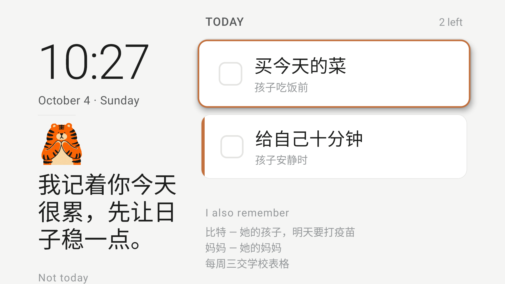

# Today

**陪着你过好今天，就是过好每一天。**

客厅那台电视，一天里大半时间是黑的。打开它，它要么卖你东西，要么给你一条看不完的信息流。

Today 把它变成别的：一块在她生活的那个房间里全天亮着的屏，替她端着今天的样子。

> 清单说的是「你还欠这些」。
> Today 说的是「这些我替你记着」。
> 分量在老虎这边，不在她那边。

为 [Build, Ship, Shape: Amazon Developer Hackathon](https://amazonappdev2026.devpost.com/) 的 Fire TV 赛道而做。

*[English README](README.md)*

---

## 给谁用

Today 是给一位家里有电视的全职妈妈做的。

她的日子是满的，但不是乱的。她在运转一个家。她想从一块屏上拿到的是**秩序和节奏**，不是搭救。她没出什么事，她只是同时端着比谁都记得住的更多的东西，想有个地方把它们放下。

她是我们对着做的那个人。但她不是唯一合适的那个：任何一个把家撑起来、房间里本来就开着一块屏的人，站的是同一个位置。

## 为什么是电视

需要你打开的屏，只有你想起来的时候才会打开——而「想起来」正是她缺的那样东西。

电视本来就开着。看一眼不要钱。所以 Today 是按**抬头一眼**设计的，不是按一次会话。一天有三眼：

- **进门那一眼**——今天还剩什么。
- **做饭那一眼**——那些长期立着的叮嘱。不能忘的事。
- **出门前那一眼**——要带的那一样，顺路能办的那一件。

它更接近酒店大堂那块板子，而不是一个 app：一直亮着，从不要求你碰它，房间另一头看得清。

## 它怎么用

她对着**手机**说一段话——乱的、重复的、带情绪的都行。到家推门进来，**电视上已经是今天了**。

她不需要站在电视前规划一天。那本来就不是电视该干的事。手机是说话的地方，电视是抬头看的地方。



## 它到底替你做什么

记住是容易的那一半。难的那一半是：有些事永远不动——不是她不想办，是每次想起来都得重新想一遍从哪儿开始。

某天晚上她说：*「保险那件事我一直拖着不想弄。」*

Today 不会往清单上加一条「办保险」。它把这件事**接过来**：

**它只问一句。** 就一句——*「是只给小的，还是大的也要？」* 两句就成了表格，而一张表格足以让这件事再拖一个月。

**她答完就拆。** 四步，每步小到一次坐下就能做完，每步带一个真能落下去的时机：*趁早上那觉*、*等她睡了之后*。

**每天只给她一步。** 从不把整个拆解倒给她。明天那一步自己会出现，她不用记「我进行到哪了」——「每天一点点」就是在这儿才成立的。

**她自己的事不许排到最后。** 她的牙、她的体检，那些永远被别人的事挤掉的。有一件搁太久了，Today 会主动提。不是催她，是告诉她这件事没被忘掉。

没有进度条。没有「保险 2/4」。她能看见完成率的那一刻，这东西就变成了她又一个要维护的看板。

## 手边没有 Fire TV？

大屏那一面在浏览器里也能跑，地址是 `/tv`——同样的版式、同样的数据，
吃的是 Fire TV app 轮询的同一个接口。方向键移动，Enter 按进去，Esc 退出来。

它不是电视那块屏的仿真图，它就是那块屏，只是换了个地方渲染。
想看看这东西长什么样又不想侧载 APK 的时候用得上；
客厅那台不在她面前的时候，她自己也用得上。

```bash
cd Today && ./start.sh      # 然后用任何有浏览器的东西打开 /tv
```

## 为什么不用遥控器说话

因为做不到。查过了，是死路：

| | |
|---|---|
| 第三方 app 读遥控器麦克风 | **不可能。** 麦克风键接到 Alexa，从不开放给 app |
| `android.speech.SpeechRecognizer` | **不可用。** Fire OS 不带 Google Play Services |
| `RECORD_AUDIO` 配 USB / 蓝牙麦克风 | 已知在 Fire TV 三代及以后会失败 |
| Video Skills Kit · Media Session API | 只有预定义指令——播放、暂停、快退、换台 |

亚马逊自己的文档写得很明白：app **无法采集任意自由口述**。

而用遥控器打字，是拿方向键在字母格子上走。一句话两分钟。

所以录音发生在**手机页面里**——不走键盘的听写键，因为很多手机根本没有（我们测过，那是个大多数人从没打开过的系统设置，产品不该押在这上面）。`MediaRecorder` 录下来，服务端转写，从这儿开始，说话和打字走同一条路。

代价只有一个：`getUserMedia` 需要安全上下文，iOS Safari 只在 HTTPS 下给麦克风权限。所以服务端前面挂的是隧道，而不是直接走局域网。

详见 [doc/input-architecture.md](doc/input-architecture.md)。

## 它不做什么

这部分和它做什么一样重要，写在这里是为了将来有人想加功能时能先回来看一眼：

- 不推荐内容
- 不接购物
- **不做进度条、完成率、连续打卡、未完成计数。** 她能看见「保险 2/4」的那一刻，这就成了她又一个要维护的看板
- **一个字都不许催。** 「你那个该去看了」是在怪她，而她本来就在怪自己。它只说自己接了什么，不说她该做什么
- 不问她为什么没做
- 不在晚上把屏幕拉到最亮

## agent 的三条规矩

写在 [`Today/src/agent/prompt.js`](Today/src/agent/prompt.js) 里，一大半是「不许做什么」：

**1. 最多三件，剩下的明确说「今天不做」。**
让人放心的不是清空列表，是知道什么被允许放下。

**2. 三件里必须有一件是给她自己的，而且必须独立成立。**
不是奖励，不是「别的都做完再说」。也不许挂在家务后面：*「买菜时顺便走走」*不算。去掉那件家务，这一件还得在。

这条是实测之后加上去的。第一版模型给出的是*「买牛奶和洗衣液——回来路上多走十分钟」*。那不是模型的错；真实世界里，一个妈妈自己的需要本来就是这么挂在别的事后面的。所以必须写死。

**3. 不许描述自己干的活。**
不报件数，不提「以后」，不解释自己为什么这么排。早期一次英文运行的开场白是*「今天只放三件，其余挪到以后」*——agent 在用整块屏上最大的字号念自己的算法。你不会跟朋友说「我已经帮你把清单压到三条了」。

## 记忆

*「这些我替你记着」*这句话必须是真的。今天说记得、明天忘光，比从没说过更伤人。所以记忆是这个角色的前提，不是 app 的一个功能。

### 不同的东西，过期速度不一样

| | | |
|---|---|---|
| 一天的样子 | 几点送学、什么时候午睡、谁几点回家 | 180 天 |
| 在办的事 | 有期限的——要交的表、约好的门诊 | 21 天 |
| 她自己 | 她为自己做过的事、她在意什么 | 不过期 |
| 一直推着的 | 反复出现又没做的 | 60 天 |
| **要紧的叮嘱** | 过敏、吃药、医生说过的话 | **永不过期** |

过期不删。只标上「记录较早，可能已经过去，用之前先确认一句」，并且告诉 agent 去问，不要默认。删掉会丢掉她说过的话，直接用会说错话，问一句是唯一安全的第三种做法。

最后一行是这套设计和这些仓库里其他记忆系统最大的不同：**过期的安全提醒，比没有提醒更危险。**

### 家里人是档案，不是一条笔记

「三岁」原来是一行自由文本。写下来那天是真的，一年后是错的，而且永远不会有人发现。

所以家里人是一份结构化的档案，存的是不动的东西：

- **存生日，不存年龄。** 年龄每次读的时候现算，所以它自己会更正。
- **她定的英文名**，这样名字不会每次重新发明一遍——没有这个字段之前，同一个孩子在一轮里出现过 *Coco* 和 *KeKe* 两种写法。
- **她给的称呼**，她没给就留空。留空时 agent 用 they；猜一个，就会把一个男孩叫成 she。

如果她只说过「他三岁」，换算成年份这件事发生在代码里，不在模型里——而且会标明是估的，所以猜出来的东西永远不会被当成确定的事实端出去。模型只报告她说了什么，算术不是它的活。

这些她都能在手机上用表单直接改。它一年也就变两次，不该为它开一次对话。

## 技术

| | |
|---|---|
| 平台 | Fire OS 8（Android 11 / API 30），实机 Toshiba 50C350NU |
| 框架 | Expo SDK 57 + [react-native-tvos](https://github.com/react-native-tvos/react-native-tvos) 0.86.3 |
| TV 配置 | [`@react-native-tvos/config-tv`](https://www.npmjs.com/package/@react-native-tvos/config-tv)，注入 `LEANBACK_LAUNCHER` / `touchscreen required=false` / `software.leanback` |
| 常亮 | `expo-keep-awake` |
| 语音 | 页面内 `MediaRecorder` → Whisper |
| agent | 供应商无关，自动兜底切换 |
| 语言 | 手机上一个开关，电视五秒内跟着变 |
| 形象 | 通义万相生成，用 [**flatcut**](https://github.com/haodaz/flatcut) 去底——从这个项目里抽出来单独开源的 |

### 两个为电视而做的设计决定

**背景随一天的光线走。**
这块屏幕全天开着。固定一块高亮浅色面板从早亮到晚，既刺眼也费电。所以背景分四个时段：清晨偏冷、白天中性、傍晚转暖、入夜整块沉下来。这不是「深色模式」开关，是一天的光线在变。见 [`Today/src/theme.ts`](Today/src/theme.ts)。

**焦点必须三米外看得见。**
电视没有触屏，只有遥控器方向键。沙发离屏幕三米，手机上那种细微的描边变化等于没有。所以聚焦时整行放大、描边变主色、投影浮起。见 [`Today/src/TaskRow.tsx`](Today/src/TaskRow.tsx)。

## 跑起来

```bash
cd Today
npm install
cp .env.local.example .env.local   # 填一个模型 key
./start.sh                          # 本地服务 + HTTPS 隧道
./release.sh && ./install.sh        # 出 APK 并装到电视上
```

需要先在 Fire TV 上开开发者模式：**设置 → My Fire TV → About → 光标停在设备名上，中间键连按 7 下**，返回后 **Developer Options** 才会出现，进去打开 **ADB Debugging**。

调 agent 不用重编 APK：

```bash
PROVIDER=openai node Today/scripts/plan.mjs "你想试的一段话"
```

这个台架会把计划按电视上的样子打印出来，并且标出三件要紧的：超过三件、**没有一件是她自己的**、标签长到一行放不下。

## 一起开源的

[**flatcut**](https://github.com/haodaz/flatcut) —— 给 AI 生成的扁平插画去底，而不会把主体内部的浅色区一起吃掉。为这个项目的老虎写的，然后抽成独立的 MIT 包——因为它会坏掉的三种方式，都是踩过才知道的。

## 许可

MIT，见 [LICENSE](LICENSE)。
